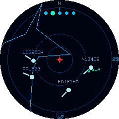

# Frank's Flight Radar

**Frank's Flight Radar** turns an [M5Dial](https://docs.m5stack.com/en/core/M5Dial) (an ESP32-S3 round-screen dev board with a rotary encoder and touchscreen) into a live, standalone aircraft radar for your desk — no phone, no app, no browser tab.

*The OpenStreetMap street map, and the offline lo-fi vector map (coastlines, cities, and airports).*

It polls [airplanes.live](https://airplanes.live/)'s free, keyless community ADS-B API for real flight traffic around a home location you choose, and plots it on a radar-style display with a real [OpenStreetMap](https://www.openstreetmap.org/) tile underlay (or an offline vector map — no network needed).

## What it does

- **Live radar display** — aircraft plotted by position, heading, altitude, and speed, refreshed on a timer you control, gliding smoothly between updates
- **Three map backgrounds** — a real OpenStreetMap street map, an offline lo-fi vector map (coastlines, borders, rivers, and city labels), or a plain radar scope
- **Rotary zoom** — five range rings from 10&nbsp;km to 200&nbsp;km, one twist per step
- **Touch to inspect** — tap any aircraft for its callsign, altitude, speed, heading, and country of registration
- **Follow an aircraft** — lock onto a plane and let the radar chase it across the map
- **Effortless location setup** — auto-detect from your network, search by place name, or enter coordinates; store up to three favourites and switch instantly
- **Emergency squawk detection** — 7500 (hijack), 7600 (radio failure), and 7700 (general emergency) are highlighted in red with an on-screen ring flash and an audible alert
- **Configurable everything** — colour themes, units, flight labels, altitude/traffic filters, refresh rate, and more, all from an on-device settings menu

See the **[full feature list](features.md)** for everything, grouped by area.

## Hardware

| | |
|---|---|
| Board | M5Stack **M5Dial** (ESP32-S3, 8&nbsp;MB flash, no PSRAM) |
| Display | 1.28" round, 240×240, capacitive touch |
| Input | Rotary encoder (zoom) + physical button (settings/reset) + touchscreen |
| Connectivity | WiFi (2.4&nbsp;GHz) |

## Where to start

- New device, never flashed? Start with **[Getting Started](getting-started.md)**.
- Already running and want to know what a button/setting does? See **[Using the Device](using-the-device.md)** and **[Settings Reference](settings-reference.md)**.
- Something's not working? Check **[Troubleshooting](troubleshooting.md)** first.

## A note on data sources

Frank's Flight Radar's positional data comes entirely from [airplanes.live](https://airplanes.live/), a free, volunteer-run community ADS-B network — no account or API key needed. Like any community network, its coverage depends on volunteer ground receivers, so in areas with sparse coverage you may occasionally see no traffic even when aircraft are genuinely nearby. See [Troubleshooting](troubleshooting.md#no-aircraft-showing) for what to expect.

Map tiles are © [OpenStreetMap](https://www.openstreetmap.org/copyright) contributors.
