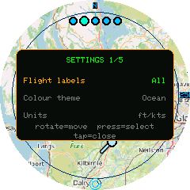
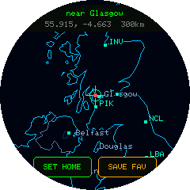

# Settings Reference

Open the settings menu with a short press of the encoder button. Rotate to move the highlighted row, press to select it. For cycling options, pressing immediately advances to the next value and saves it — you stay in the menu, so you can adjust several settings in one visit. Tap anywhere to close.



Settings are saved to flash immediately as you change them (no separate "save" step), and persist across reboots and firmware updates.

## Flight labels

Controls when an aircraft's callsign is shown next to its dot.

| Value | Behaviour |
|---|---|
| Off | Never show callsigns |
| **Selected** *(default)* | Only the currently-tapped aircraft shows its callsign |
| All | Every aircraft shows its callsign at all times |

Emergency-squawking aircraft always show their callsign regardless of this setting.

## Colour theme

Four full colour palettes for the radar display — background, rings, aircraft, selection highlight, and text all change together.

- **Radar** *(default)* — classic green-on-black
- **Amber** — amber/orange monochrome, reminiscent of older radar displays
- **Ocean** — blues and cyans
- **Neon** — high-contrast magenta/cyan

The settings menu itself always uses a fixed look regardless of this choice, so it stays legible no matter which radar theme is active.

## Units

| Value | Altitude | Speed |
|---|---|---|
| **ft/kts** *(default)* | Feet | Knots |
| m/km/h | Metres | Kilometres per hour |

Applies to the aircraft detail panel (tap an aircraft to see it).

## Traffic

Which aircraft are drawn on the radar.

| Value | Behaviour |
|---|---|
| **Airborne** *(default)* | Aircraft on the ground are hidden |
| All | On-ground aircraft are shown too (in grey, no heading line) |

## Min altitude

Hides aircraft below a given altitude (those with a known, positive altitude reading only — aircraft with no altitude data, e.g. many on the ground, are unaffected by this filter and governed by **Traffic** instead).

Options: **Off** *(default)*, 1,000&nbsp;ft, 5,000&nbsp;ft, 10,000&nbsp;ft, 20,000&nbsp;ft.

## Heading trails

| Value | Behaviour |
|---|---|
| **On** *(default)* | Airborne aircraft (over 5&nbsp;m/s ground speed) show a short arrow indicating their direction of travel, **and** the currently-selected aircraft leaves a fading breadcrumb trail of its recent positions |
| Off | No heading arrows and no trails |

## Range rings

| Value | Behaviour |
|---|---|
| **On** *(default)* | The three range rings, N tick, and range labels are drawn |
| Off | Radar screen shows only the map, home crosshair, and aircraft |

## Map

The background style drawn beneath the radar.

| Value | Behaviour |
|---|---|
| **Lo-fi** *(default)* | An **offline vector map** — coastlines, borders, rivers, and lakes as themed lines, plus labels for major cities and airports. The whole world is embedded in the firmware, so it needs no network, switches instantly, and stays smooth while [following](using-the-device.md#following-an-aircraft) an aircraft. It's the default because, with no tile fetching, it's the most robust option on this no-PSRAM board. |
| Full | A real OpenStreetMap street map, fetched per location/zoom and cached to flash. See [Map & Caching](map-caching.md). |
| Off | A plain themed background (classic radar-scope look). |

The lo-fi map is deliberately low-detail — it's meant as a lightweight geographic reference, not a street map.

## Refresh rate

How often Frank's Flight Radar polls [airplanes.live](https://airplanes.live/) for updated positions.

| Value | Behaviour |
|---|---|
| 5s | Fastest option — livelier motion, more requests |
| **8s** *(default)* | A brisk cadence with plenty of headroom under airplanes.live's fair-use guidance (~1 request/second) |
| 15s / 30s | Slower options, for anyone who'd rather poll less |

There's no account, credit, or quota system to manage — pick whichever feels right. Slower rates make dead-reckoning interpolation do more of the visible work between polls; see [Using the Device](using-the-device.md) for how aircraft glide between updates.

## Buzz on Emergency

| Value | Behaviour |
|---|---|
| **On** *(default)* | An emergency squawk (7500/7600/7700) triggers a flashing red ring around the screen bezel and three audible tones |
| Off | Emergency aircraft are still highlighted visually on the radar, but silently |

See [Emergency Alerts](emergency-alerts.md) for details.

## Aircraft icon

How each aircraft is drawn on the radar.

| Value | Behaviour |
|---|---|
| Dot | A round mark, with a separate short arrow showing its direction of travel (the arrow follows the **Heading trails** setting) |
| **Plane** *(default)* | A small triangle whose nose points along the aircraft's track, so direction is readable from the shape itself — no separate arrow is drawn |

Both styles use the same colour coding (airborne / on-ground / selected / emergency) and the same size increase for the selected aircraft.

## Set location

Opens a full-screen map to pick your home location right on the device — no phone, no typing.



- **Drag** the map to move your spot under the centre crosshair.
- **Twist the dial** to zoom, from country level down to about town level, for precision.
- The top readout shows the **nearest city**, your **coordinates**, and the current zoom radius.
- **SET HOME** makes the crosshair location your home; **SAVE FAV** stores it to one of the three [favourite](favourite-locations.md) slots; the encoder button cancels.

Because it draws on the offline [lo-fi map](map-caching.md#the-lo-fi-vector-map), panning is instant with nothing to download.

## Detect location

Re-detects your home location from the device's public IP address — no typing, no captive portal. Useful after moving, or as a quick way to re-centre. Accuracy is city-level and can be thrown off by a VPN; for a precise fix, use **Location & Favourites** (place-name search or manual coordinates) instead.

## Web Config

Shows where to reach the device's web page. The page is **always running** on your home network — you don't need this menu item to use it, it just tells you the address:

```
http://flightradar.local
```

(plus the raw IP, in case your network doesn't do mDNS name resolution).

Open it from any browser on the same network. The **Config** page holds everything you can customise:

- **Home location** — by place name, by coordinates, or blank to auto-detect
- **Favourite locations** — name and edit all three ([more](favourite-locations.md))
- **Display & behaviour** — every option on this page (flight labels, colour theme, units, traffic filter, min altitude, heading trails, range rings, map, refresh rate, emergency buzzer, aircraft icon) as dropdowns

The dropdowns are generated from the same list the on-device menu uses, so the two can never drift apart, and they always open showing what the device currently holds — including changes you made on the dial itself.

**Configure WiFi** is a separate page and deals only with network credentials.

Changes save straight to the device; no restart, and the radar keeps running the whole time.

If the device isn't on WiFi there's nothing to point you at, so this falls back to the old captive-portal AP (`Franks-Flight-Radar-Setup` / `192.168.4.1`) — which is also the only way to enter credentials for a new network. See [Getting Started](getting-started.md).

## Saved Locations

Opens a picker for your three saved favourite locations (set via **Set location** or **Location & Favourites**). Rotate to highlight one, press to make it your active home location. See [Favourite Locations](favourite-locations.md).

## Power Off

Switches the device off. Only meaningful when running on battery: it releases the M5Dial's power-hold latch, cutting power to the board. Press the **side button** to switch back on.

With USB attached the port keeps supplying power, so the device comes straight back up rather than staying off — unplug first if you want it to stay off.

There's no confirmation step, since recovering is a single button press.

## Factory Reset

Hold-to-confirm (3 seconds) reset that wipes WiFi credentials, home location, and saved favourites, then reboots into first-boot setup. Releasing early, tapping the screen, or 15 seconds of inactivity cancels it.
