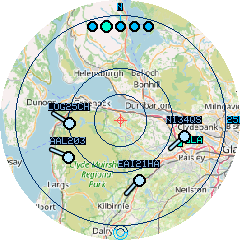
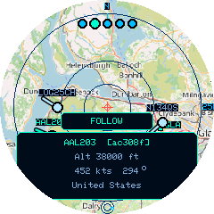
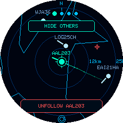
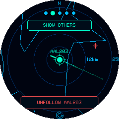
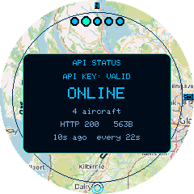

# Using the Device

Frank's Flight Radar has three inputs: the **rotary encoder** (twist and press), and the **touchscreen**. Here's what each does on the main radar screen.

## The radar display

- The **red crosshair** at the centre is your home location.
- The **background** is one of three styles, set under Settings → Map: a real street map, an offline lo-fi vector map, or a plain scope. See [Settings Reference](settings-reference.md#map) and [Map & Caching](map-caching.md).
- **Concentric rings** mark 25%, 50%, and 100% of the current zoom radius, with an **N** tick at the top and range labels on the right (toggle these off under Settings → Range rings).
- Aircraft are drawn as dots with a short heading line, coloured by state:
    - White (or your theme's aircraft colour) — normal, airborne
    - Grey — on the ground
    - Orange — currently selected (tapped)
    - **Red, with an extra ring** — squawking an emergency code (7500/7600/7700); see [Emergency Alerts](emergency-alerts.md)
- Aircraft **glide smoothly** between refreshes rather than jumping — their positions are dead-reckoned from heading and speed, so motion looks continuous even between polls.
- A small **battery gauge** appears at the top right *on hardware that reports battery state*: an outline that fills in proportion to charge, turning amber below 30% and red below 10%, with a bolt through it while charging. The M5Dial does not expose battery voltage to its processor, so nothing is shown there — see [Building From Source](development.md) for the measurements behind that.
- A small **poll icon** sits near the bottom of the screen: a shrinking ring counts down to the next automatic refresh, a solid ring means a request is in flight, and a **solid red ring** means the last request failed.

## Rotary encoder: zoom

Rotate the dial to change the radar range. There are five steps: **10, 25, 50, 100, and 200&nbsp;km**. Each click moves exactly one step, and steps register immediately. This hardware's encoder emits occasional spurious single ticks, so the firmware only commits a step once the count has moved a full detent — sub-detent noise is rejected outright rather than waited out, which keeps the dial responsive.

The rings, scale and map redraw instantly. Fetching fresh traffic for the new radius is deferred briefly, so spinning through several levels makes one request rather than one per level — and because fetches run off the UI thread, none of it delays the dial.

## Touch: select an aircraft

**Tap an aircraft's dot** to open a detail panel showing its callsign, ICAO24 address, altitude, speed, heading, and country of registration. Tap the same aircraft again (or tap elsewhere) to dismiss it.

While an aircraft is selected, it also leaves a short **trail** of its recent positions (a fading breadcrumb line), and the **rotary dial cycles the selection** through the other visible aircraft instead of zooming. Trails share the **Heading trails** setting — turn that off to hide both the heading arrows and the trail.

## Following an aircraft

To keep an aircraft centred as it flies, **follow** it:

1. Tap the aircraft to select it and open its detail panel.
2. Tap the **FOLLOW** button just above the panel.

The radar re-centres on that aircraft and tracks it: a **reticle** marks the tracked point, your **home** becomes a small offset marker (so you can still tell which way home is), and its **altitude and speed** are printed just below its mark. Other traffic drifts past as the aircraft moves.

*Following AAL203 — the **HIDE OTHERS** toggle is at the top, **UNFOLLOW** at the bottom. After tapping HIDE OTHERS (right), only the tracked aircraft remains.*

- The **rotary dial zooms** while following (the selection is locked onto your target).
- **HIDE OTHERS** (top button) drops all the other traffic so only your target and the map remain; tap it again (**SHOW OTHERS**) to bring them back.
- **Drag anywhere** to pan the view around the tracked aircraft — useful when a button is covering something you want to see. While panned, a small **reticle icon** appears on the right edge as a reminder; a plain tap (no drag) snaps back to centred.
- If the aircraft stops being seen, a red **NO SIGNAL** notice appears with a counter showing how long it's been out of contact. The view keeps coasting along its last known heading meanwhile, so a still-looking mark reads as "dead reckoning" rather than a frozen device. Follow ends if it stays unseen for 20 minutes.
- With the **Full** map, the background **re-centres lazily** — it stays put while the aircraft drifts within view, then snaps to re-centre once it wanders far enough, briefly reloading the map there. On the **Lo-fi** or **Off** background this is instant with no reload, so following feels smoothest there.
- Follow is a **locked mode** — ordinary taps do not back out of it. It ends when you tap **UNFOLLOW**, or when the aircraft has not been seen for 20 minutes (it has landed, or left ADS-B coverage). Through shorter gaps the view keeps coasting along the aircraft's last known heading and re-acquires it when it reappears.

## Touch: drag to look around

**Drag anywhere on the radar** to shift the view off centre — handy for seeing what's behind the detail panel, or just looking further one way. A **reticle icon** appears on the right edge while the view is off centre; tap it to snap back.

Panning only moves what's *drawn*. Your home location and the area being searched for aircraft don't change, and the drag is limited so you can't lose the centre entirely.

Tapping still selects aircraft as normal — only a deliberate drag pans, so a slightly imprecise tap won't move the map.

## Touch: check API status

**Tap the poll icon** (bottom of the screen) to open the **API status panel** — this shows whether the last request succeeded, the HTTP status code and response size, a short reason on failure, and how long ago it happened. Tap anywhere to dismiss it. This is the fastest way to check *why* aircraft aren't showing — see [Troubleshooting](troubleshooting.md).

## Encoder button: settings & reset

- **Short press** (under 3 seconds): opens the **Settings menu** as a floating panel over the live radar. See [Settings Reference](settings-reference.md) for every option. Rotate to move the cursor, press to select/cycle a value, and **tap anywhere on the screen** to close the menu at any time (it also auto-closes after 30 seconds of inactivity).
- **Hold for 3 seconds**: triggers a **factory reset** — this wipes WiFi credentials, home location, and saved favourites, then reboots into first-boot setup. There's no confirmation for this physical-button combo (it's designed as a recovery mechanism when the device is otherwise unusable), so use it deliberately. The same action is also available as a hold-to-confirm menu item under **Settings → Factory Reset**, which is the safer route for everyday use.
